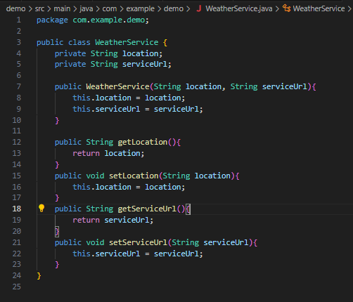
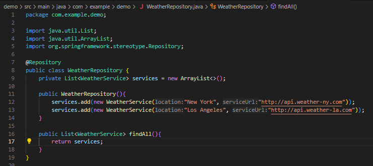
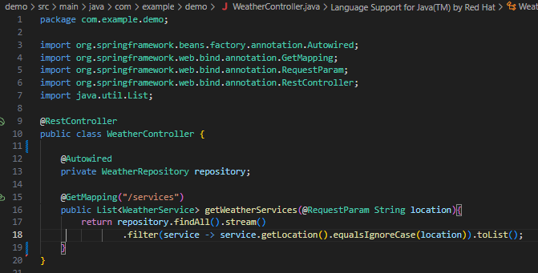

# Actividad Teams => Programación e implementación de soluciones basadas en UDDI
Para esta actividad intentamos simular un sistema UDDI, en donde, creamos un sistema que nos proporciona servicios API en donde podemos obtener la información del clima en dependiendo de la localidad ingresada. Como esta actividad es una simulación sobre como podemos visualizar que es un sistema UDDI, solo puede proporcionar pocos links.

# ¿Qué es UDDI?
Las siglas significan Universal Description, Discovery, and Integration. Podemos entender que es un estándar en donde se publican servicios web. Podemos imaginarlo como un directorio de servicios web, que nos facilita la integración de servicios web en nuestras aplicaciones.

# Informacion del proyecto.
Para este proyecto, necesitamos el lenguaje de programacion de java, a su vez, de su framework Spring boot.

# Modificacion de archivos .java
Para este trabajo se usó Visual Studio code con la extensión de Spring Boot y Java. También se usó las dependencias de Spring Web.

Una vez generado todos los directorios que nos ofrece esta extensión, empezamos a trabajar sobre el directorio *main\java\com\example\demo*.

## Archivo WeatherServices.java
Primero, creamos un archivo llamado `WeatherService`. Este archivo nos permitirá crear las variables que nos servirán para identificar la localidad de donde se quiere obtener las APIs del clima, a su vez de proporcionar la URL de esa API.

## Archivo WeatherRepository.java
Este archivo `WeatherRepository.java` nos permitirá simular el sistema UDDI, en donde tendremos las múltiples APIs que nos proporcionan el servicio del clima dependiendo de la localidad. Por lo tanto, necesitamos almacenar las APIs en un arreglo, después la información será devuelta por una función.

## Archivo WeatherController.java
En `WeatherController.java` vamos a mostrar la URL de o el servicio web de clima dependiendo de la localidad.

