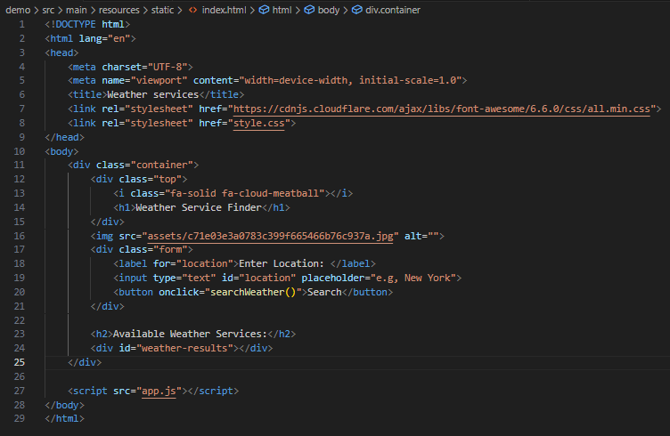
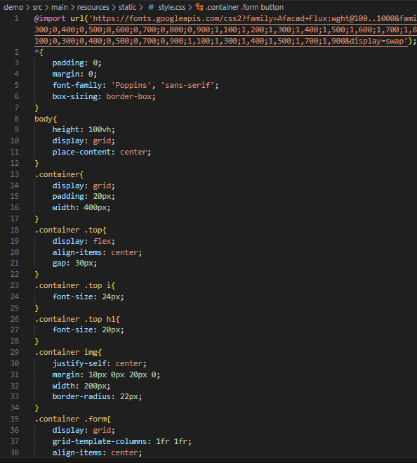
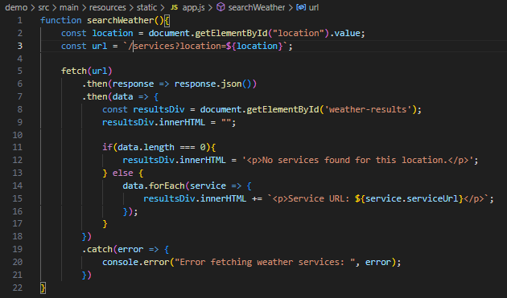
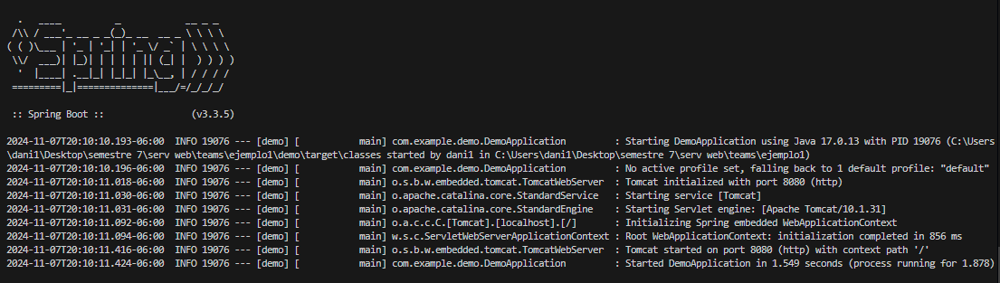
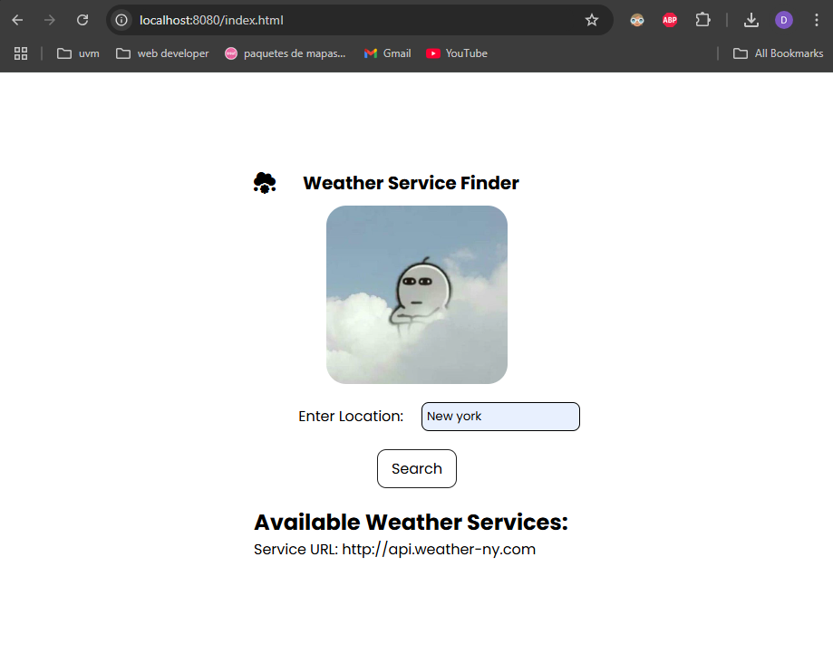

# Actividad Teams => Programación e implementación de soluciones basadas en UDDI
Para esta actividad intentamos simular un sistema UDDI, en donde, creamos un sistema que nos proporciona servicios API en donde podemos obtener la información del clima en dependiendo de la localidad ingresada. Como esta actividad es una simulación sobre como podemos visualizar que es un sistema UDDI, solo puede proporcionar pocos links.

# Tabla de contenido.
1. [¿Qué es UDDI?](#qué-es-uddi)
2. [Información del proyecto](#informacion-del-proyecto)
3. [Modificación de archivo .java](#modificacion-de-archivos-java)
4. [Agregar FrontEnd](#agregar-frontend)

# ¿Qué es UDDI?
Las siglas significan Universal Description, Discovery, and Integration. Podemos entender que es un estándar en donde se publican servicios web. Podemos imaginarlo como un directorio de servicios web, que nos facilita la integración de servicios web en nuestras aplicaciones.

# Informacion del proyecto.
Para este proyecto, necesitamos el lenguaje de programacion de java, a su vez, de su framework Spring boot.

# Modificacion de archivos .java
Para este trabajo se usó Visual Studio code con la extensión de Spring Boot y Java. También se usó las dependencias de Spring Web.

Una vez generado todos los directorios que nos ofrece esta extensión, empezamos a trabajar sobre el directorio *main\java\com\example\demo*.

## Archivo WeatherServices.java
Primero, creamos un archivo llamado `WeatherService`. Este archivo nos permitirá crear las variables que nos servirán para identificar la localidad de donde se quiere obtener las APIs del clima, a su vez de proporcionar la URL de esa API.

## Archivo WeatherRepository.java
Este archivo `WeatherRepository.java` nos permitirá simular el sistema UDDI, en donde tendremos las múltiples APIs que nos proporcionan el servicio del clima dependiendo de la localidad. Por lo tanto, necesitamos almacenar las APIs en un arreglo, después la información será devuelta por una función.

## Archivo WeatherController.java
En `WeatherController.java` vamos a mostrar la URL de o el servicio web de clima dependiendo de la localidad.

# Agregar FrontEnd
Para nuestro FrontEnd usaremos HTML y CSS, esto nos servirá para darle estilos simples para que el usuario pueda visualizar de mejor forma la información que le proporcionaremos y con JavaScript podremos conectar el BackEnd con el FrontEnd para mostrar la información.

## Archivo HTML
En el archivo `index.html` tendremos la estructura de nuestra página, así como los elementos que usaremos en JS para mostrar la información del BackEnd.

## Archivo CSS
En el archivo `style.css` pondremos todos los estilos de nuestra página, de este modo, podremos tener una página con un diseño simple y llamativo para el usuario. La captura de este archivo es corta, ya que contiene mucha información.

## Archivo JavaScript
En este archivo llamado `app.js` tendremos el backend conectado con el frontend, esto nos permitirá introducir datos desde nuestra página, hacer la consulta en el backend y visualizarla en la página.

# Proyecto en Funcionamiento
Para comprobar que el servicio se esta ejecutando de manera local correctamente tenemos que ver la siguiente captura:

Para visualizar la pagina que hemos creado, tenemos que colocar `http://localhost:8080/index.html` en nuestro navegador, por ultimo, veremos lo siguiente:

Podemos ver como la pagina esta en funcionamiento, se agrego el parametro "New york" para visualizar una de las APIs que agregamos.
